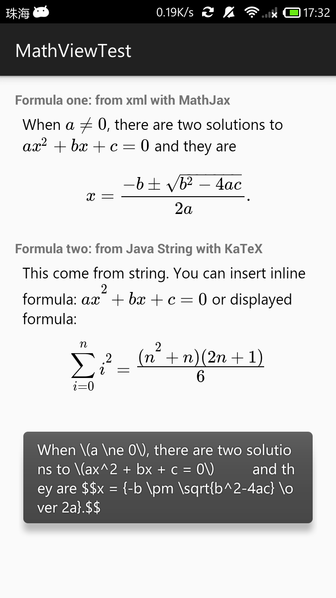
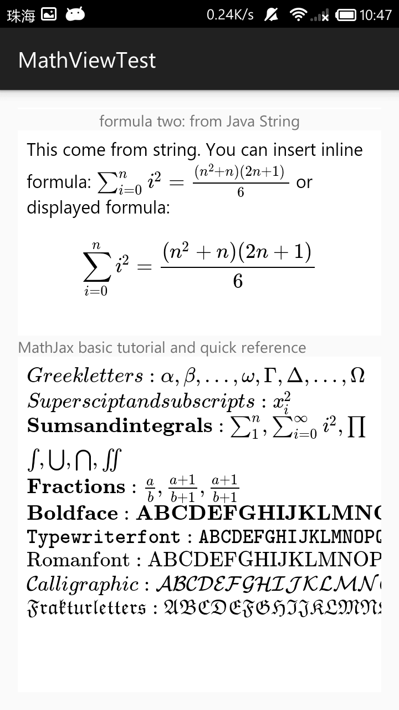

# MathView
[  ](https://bintray.com/kexanie/maven/MathView/_latestVersion) 

`MathView` is a third-party view library, which might help you display math formula on Android apps easier. Support Android version 4.1 (Jelly Bean) and newer.

  

## Setup

There are two ways you can add `MathView` to your project in Android Studio:

1. From a remote Maven repository (jcenter).
2. From a local .aar file.

### 1. Setup from a remote Maven repository (jcenter)

Add `compile 'io.github.kexanie.library:MathView:0.0.2'` into **dependencies** section of your **module** build.gradle file. For example:

```
dependencies {
    compile fileTree(include: ['*.jar'], dir: 'libs')
    compile 'com.android.support:appcompat-v7:23.0.0'
    compile 'io.github.kexanie.library:MathView:0.0.2'
}
```

### 2. Setup from local .aar file 

You can download the latest version of MathView from [Bintray](https://bintray.com/kexanie/maven/MathView/_latestVersion "Bintray").

1) Import the module from local .aar file

Click `File -> New -> New Module` (yes, not `import Module`) `-> Import .JAR/.AAR Package`, and find out where the file located.

2) Add dependency

Click `File -> Project Structure -> Dependencies`, and then click the plus icon, select `3. Module Dependency`.

#### For Eclipse users
Just migrate to Android Studio.

## Usage

The behaviour of `MathView` is nearly the same as `TextView`, except that it will automatically render **TeX code** into math formula. For basic tutorial and quick reference, please have a look on [tutorial].

**Caution:**

1. You should enclose the formula in `\(...\)` rather than `$...$` for inline formulas.
2. You need to escape spacial characters like backslash, quotes and so on in Java code.
3. If you want to make the height of `MathView` actually `wrap_content`, warp the views into `NestedScrollView`.

### Define `MathView` in your layout file
For example:

```
<android.support.v4.widget.NestedScrollView
    android:layout_width="match_parent"
    android:layout_height="wrap_content">
    <LinearLayout
        android:layout_width="match_parent"
        android:layout_height="wrap_content"
        android:orientation="vertical">

        <TextView
            android:layout_width="match_parent"
            android:layout_height="wrap_content"
            android:text="formula one: from xml attribute"
            android:gravity="center"/>

        <io.github.kexanie.library.MathView
            android:id="@+id/formula_one"
            android:layout_width="match_parent"
            android:layout_height="wrap_content"
            auto:text="When \\(a \\ne 0\\), there are two solutions to \\(ax^2 + bx + c = 0\\)
                and they are $$x = {-b \\pm \\sqrt{b^2-4ac} \\over 2a}.$$"
            >
        </io.github.kexanie.library.MathView>

        <TextView
            android:layout_width="match_parent"
            android:layout_height="wrap_content"
            android:text="formula two: from Java String"
            android:gravity="center_horizontal"/>

        <io.github.kexanie.library.MathView
            android:id="@+id/formula_two"
            android:layout_width="match_parent"
            android:layout_height="wrap_content"
            >
        </io.github.kexanie.library.MathView>

        <TextView
            android:layout_width="match_parent"
            android:layout_height="wrap_content"
            android:text="MathJax basic tutorial and quick reference"/>

        <io.github.kexanie.library.MathView
            android:id="@+id/font_test"
            android:layout_width="match_parent"
            android:layout_height="wrap_content"
            >
        </io.github.kexanie.library.MathView>
    </LinearLayout>
</android.support.v4.widget.NestedScrollView>
```

### Get an instance from your `Activity`
```
public class MainActivity extends AppCompatActivity {
    MathView math_one;
    MathView math_two;
    MathView font_test;
    String tex = "This come from string. You can insert inline formula:" +
            " \\(\\sum_{i=0}^n i^2 = \\frac{(n^2+n)(2n+1)}{6}\\) " +
            "or displayed formula: $$\\sum_{i=0}^n i^2 = \\frac{(n^2+n)(2n+1)}{6}$$";

    @Override
    protected void onCreate(Bundle savedInstanceState) {
        super.onCreate(savedInstanceState);
        setContentView(R.layout.activity_main);
    }

    @Override
    protected void onResume() {
        super.onResume();

        math_one = (MathView) findViewById(R.id.formula_one);
        math_two = (MathView) findViewById(R.id.formula_two);
        font_test = (MathView) findViewById(R.id.font_test);

        // This toast will print raw TeX string
        Toast.makeText(this, math_one.getText(), Toast.LENGTH_LONG).show();
        math_two.setText(tex);
        font_test.setText(
                "\\(Greek letters: \\alpha, \\beta, …, \\omega, \\Gamma, \\Delta, …, \\Omega\\)" +
                "\\(Superscipt and subscripts: x_i^2\\)" +
                "\\(\\mathbf{Sums and integrals}: \\sum_1^n, \\sum_{i=0}^\\infty i^2, \\prod \\\\" +
                        " \\int, \\bigcup, \\bigcap, \\iint\\)" +
                "\\(\\mathbf{Fractions}: \\frac ab, \\frac{a+1}{b+1}, {a+1\\over b+1}\\)" +
                        "\\(\\mathbf{Boldface}: \\mathbf{ABCDEFGHIJKLMNOPQRSTUVWXYZ}\\)" +
                        "\\(\\mathtt{Typewriter font}: \\mathtt{ABCDEFGHIJKLMNOPQRSTUVWXYZ}\\)" +
                        "\\(\\mathrm{Roman font}: \\mathrm{ABCDEFGHIJKLMNOPQRSTUVWXYZ}\\)" +
                        "\\(\\mathcal{Calligraphic}: \\mathcal{ABCDEFGHIJKLMNOPQRSTUVWXYZ}\\)" +
                        "\\(\\mathfrak {Fraktur letters}: \\mathfrak {ABCDEFGHIJKLMNOPQRSTUVWXYZ}\\)");
    }
}
```
**Noted that the method `MatView.getText()` will return the raw TeX code (Java `String`).**

## How it works
`MathView` inherited from Android `WebView` and use the javascript library [MathJax](https://www.mathjax.org/ "MathJax") (a lightweight version) to do the rendering stuff. Another library called [Chunk](https://github.com/tomj74/chunk-templates/ "Chunk") is just an lightweight Java template engine for filling the TeX code into an html file. So MathJax can render it. It's still rather primitive, but at least functional.

```
public class MathView extends WebView {
    private Chunk chunk;
    private String mText;
    private TypedArray mTypeArray;

    public MathView(Context context, AttributeSet attrs) {
        super(context, attrs);
        this.getSettings().setJavaScriptEnabled(true);
        AndroidTemplates loader = new AndroidTemplates(context);
        chunk = new Theme(loader).makeChunk("mathview");

        mTypeArray = context.getTheme().obtainStyledAttributes(
                attrs,
                R.styleable.MathView,
                0, 0
        );

        try {
            setText(mTypeArray.getString(R.styleable.MathView_text));
        } finally {
            mTypeArray.recycle();
        }
    }

    public void setText(String text) {
        mText = text;
        chunk.set("formula", mText);
        this.loadDataWithBaseURL(
            null, chunk.toString(), "text/html", "utf-8", "about:blank");
    }

    public String getText() {
        return mText;
    }
}
```
Check the code for more details.

## Known Bugs

1. Some characters are blank(like character 'B' of BlackBoard Bold font) due to MathJax's [bug] on Android `WebView`.


## Feedback

If you have any issues or need help please do not hesitate to create an issue ticket.


[tutorial]: http://meta.math.stackexchange.com/questions/5020/mathjax-basic-tutorial-and-quick-reference
[bug]: https://github.com/mathjax/MathJax/issues/403