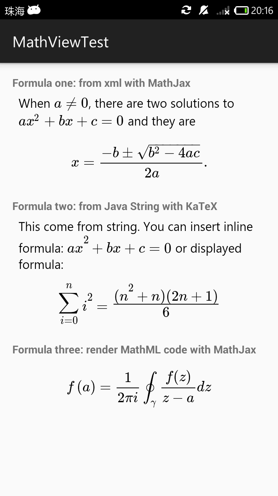

# MathView
[](http://android-arsenal.com/details/1/2957) [ ](https://bintray.com/kexanie/maven/MathView/_latestVersion) 

`MathView` is a third-party view library, which might help you display math formula on Android apps easier. Two rendering engines available: [MathJax] and [KaTeX]. Support Android version 4.1 (Jelly Bean) and newer. 



## Setup

There are two ways you can add `MathView` to your project in Android Studio:

1. From a remote Maven repository (jcenter).
2. From a local .aar file.

### 1. Setup from a remote Maven repository (jcenter)

Add `compile 'io.github.kexanie.library:MathView:0.0.6'` into **dependencies** section of your **module** build.gradle file. For example:

```groovy
dependencies {
    compile fileTree(include: ['*.jar'], dir: 'libs')
    compile 'com.android.support:appcompat-v7:23.0.0'
    compile 'io.github.kexanie.library:MathView:0.0.6'
}
```

### 2. Setup from local .aar file 

You can download the latest version of MathView from [Bintray](https://bintray.com/kexanie/maven/MathView/_latestVersion "Bintray").

1) Import the module from local .aar file

Click `File -> New -> New Module` (yes, not `import Module`) `-> Import .JAR/.AAR Package`, and find out where the file located.

2) Add dependency

Click `File -> Project Structure -> Dependencies`, and then click the plus icon, select `3. Module Dependency`.

#### For Eclipse users
Just migrate to Android Studio.

## Usage

The behaviour of `MathView` is nearly the same as `TextView`, except that it will automatically render **TeX code** (or MathML code if rendering with MathJax) into math formula. For basic tutorial and quick reference, please have a look on this [tutorial].

**Caution**

1. You should enclose the formula in `\(...\)` rather than `$...$` for inline formulas.
2. You need to escape spacial characters like backslash, quotes and so on in Java code.
3. If you want to make the height of `MathView` actually `wrap_content`, warp the views into `NestedScrollView`.

**About the engines**

KaTeX is faster than MathJax on mobile environment, but MathJax supports more features and is much more beautiful. Choose whatever suits your needs. 

### Define `MathView` in your layout file
For example:

```xml
<LinearLayout ...>

    <TextView
        android:layout_width="match_parent"
        android:layout_height="wrap_content"
        android:text="Formula one: from xml with MathJax"
        android:textStyle="bold"/>

    <io.github.kexanie.library.MathView
        android:id="@+id/formula_one"
        android:layout_width="match_parent"
        android:layout_height="wrap_content"
        auto:text="When \\(a \\ne 0\\), there are two solutions to \\(ax^2 + bx + c = 0\\)
        and they are $$x = {-b \\pm \\sqrt{b^2-4ac} \\over 2a}.$$"
        auto:engine="MathJax"
        >
    </io.github.kexanie.library.MathView>

    <TextView
        android:layout_width="match_parent"
        android:layout_height="wrap_content"
        android:text="Formula two: from Java String with KaTeX"
        android:textStyle="bold"/>

    <io.github.kexanie.library.MathView
        android:id="@+id/formula_two"
        android:layout_width="match_parent"
        android:layout_height="wrap_content"
        auto:engine="KaTeX"
        >
    </io.github.kexanie.library.MathView>

</LinearLayout>

```

### Get an instance from your `Activity`
```java
public class MainActivity extends AppCompatActivity {
    MathView formula_two;
    String tex = "This come from string. You can insert inline formula:" +
            " \\(ax^2 + bx + c = 0\\) " +
            "or displayed formula: $$\\sum_{i=0}^n i^2 = \\frac{(n^2+n)(2n+1)}{6}$$";

    @Override
    protected void onCreate(Bundle savedInstanceState) {
        super.onCreate(savedInstanceState);
        setContentView(R.layout.activity_main);
    }

    @Override
    protected void onResume() {
        super.onResume();

        formula_two = (MathView) findViewById(R.id.formula_two);
        formula_two.setText(tex);
    }
}
```

**Noted that the method `MatView.getText()` will return the raw TeX code (Java `String`).**

### Configuration

I am not an expert in MathJax. Rather than providing a pre-configured version of MathJax, I choose to add another method `config()`(for MathJax only) to `MathView` in version `0.0.5`. You can tweak MathJax with more complicated configurations. For example, to enable auto linebreaking, you can call

```java
MathView.config(
"MathJax.Hub.Config({\n"+
            "  CommonHTML: { linebreaks: { automatic: true } },\n"+
            "  \"HTML-CSS\": { linebreaks: { automatic: true } },\n"+
            "         SVG: { linebreaks: { automatic: true } }\n"+
            "});");
```
before `setText()`.

## How it works

`MathView` inherited from Android `WebView` and use javascript ( [MathJax] or [KaTeX] ) to do the rendering stuff. Another library called [Chunk] is just an lightweight Java template engine for filling the TeX code into an html file. So we can render it. It's still rather primitive, but at least functional. Check the code for more details.

## Known Issues

1. When rendering with MathJax, some characters are blank(like character 'B' of BlackBoard Bold font) due to MathJax's [bug] on Android `WebView`.
2. Not all TeX commands are supported by KaTeX, check this [link] for more details.


## Feedback

If you have any issues or need help please do not hesitate to create an issue ticket.

[tutorial]: http://meta.math.stackexchange.com/questions/5020/mathjax-basic-tutorial-and-quick-reference
[bug]: https://github.com/mathjax/MathJax/issues/403
[MathJax]: https://www.mathjax.org/
[KaTeX]: https://github.com/Khan/KaTeX
[Chunk]: https://github.com/tomj74/chunk-templates/
[link]: https://github.com/Khan/KaTeX/wiki/Function-Support-in-KaTeX
