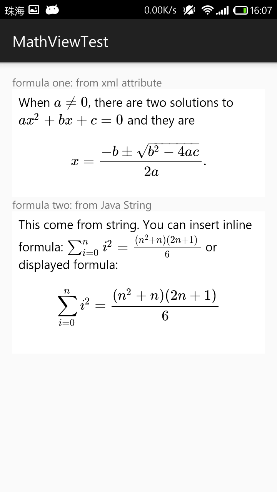

# MathView

MathView is a third-party view library, which might help you display math formula on Android apps easier. Support Android version 4.0 (Ice Cream Sandwich) and newer.

## Setup

There are two ways you can add MathView to your project in Android Studio:

1. From a remote Maven repository (jcenter).
2. From a local .aar file.

### 1. Setup from a remote Maven repository (jcenter)

Add `compile 'io.github.kexanie.library:MathView:0.0.1'` into **dependencies** section of your **module** build.gradle file. For example:

```
dependencies {
    compile fileTree(include: ['*.jar'], dir: 'libs')
    compile 'com.android.support:appcompat-v7:23.0.0'
    compile 'io.github.kexanie.library:MathView:0.0.1'
}
```

### 2. Setup from local .aar file
You can download the latest version of MathView from [Bintray](https://bintray.com/kexanie/maven/MathView/_latestVersion "Bintray").

[  ](https://bintray.com/kexanie/maven/MathView/_latestVersion) 

1) Import the module from local .aar file

Click `File` -> `New` -> `New Module` (yes, not `import Module`) -> `Import .JAR/.AAR Package`, and find out where the file located.

2) Add dependency
Click `File` -> `Project Structure` -> `Dependencies`, and then click the plus icon, select `3. Module Dependency`.

##### For Eclipse user
Just migrate to Android Studio.

## Usage

The behaviour of `MathView` is nearly the same as `TextView`, except that it will automatically render **TeX code** into math formula. 

### Define `MathView` in your layout file
For example:

```
<RelativeLayout xmlns:android="http://schemas.android.com/apk/res/android"
    xmlns:tools="http://schemas.android.com/tools"
    xmlns:auto="http://schemas.android.com/apk/res-auto"
    android:layout_width="match_parent"
    android:layout_height="match_parent"
    android:paddingLeft="@dimen/activity_horizontal_margin"
    android:paddingRight="@dimen/activity_horizontal_margin"
    android:paddingTop="@dimen/activity_vertical_margin"
    android:paddingBottom="@dimen/activity_vertical_margin"
    tools:context=".MainActivity">

    <io.github.kexanie.library.MathView
        android:id="@+id/formula_one"
        android:layout_width="match_parent"
        android:layout_height="wrap_content"
        auto:text="When \\(a \\ne 0\\), there are two solutions to \\(ax^2 + bx + c = 0\\) and they are $$x = {-b \\pm \\sqrt{b^2-4ac} \\over 2a}.$$"
        >
    </io.github.kexanie.library.MathView>

</RelativeLayout>
```
**Please pay attention that you need to escape spacial characters like backslash, quotes and so on.**

(I am trying to fix the escaping problem.)

### Get an instance from your `Activity`
```
public class MainActivity extends AppCompatActivity {
    MathView mMathView;

    @Override
    protected void onCreate(Bundle savedInstanceState) {
        super.onCreate(savedInstanceState);
        setContentView(R.layout.activity_main);
    }

    @Override
    protected void onResume() {
        super.onResume();

        mMathView = (MathView) findViewById(R.id.formula_one);
        
        // This toast will print raw TeX string
        Toast.makeText(this, mMathView.getText(), Toast.LENGTH_LONG).show(); 
        
        return true;
    }

    @Override
    public boolean onCreateOptionsMenu(Menu menu) {
        // Inflate the menu; this adds items to the action bar if it is present.
        getMenuInflater().inflate(R.menu.menu_main, menu);
    }
}
```
**Noted that the method `MatView.getText()` will return the raw TeX code (Java `String`).**

## How it works
`MathView` inherited from Android `WebView` and use the javascript library [MathJax](https://www.mathjax.org/ "MathJax") (a lightweight version) to do the rendering stuff. Another library called [Chunk](https://github.com/tomj74/chunk-templates/ "Chunk") is just an lightweight Java template engine for filling the TeX code into an html file. So MathJax can render it. It's still rather primitive, but at least functional.

```
public class MathView extends WebView {
    private Chunk chunk;
    private String mText;
    private TypedArray mTypeArray;

    public MathView(Context context, AttributeSet attrs) {
        super(context, attrs);
        this.getSettings().setJavaScriptEnabled(true);
        AndroidTemplates loader = new AndroidTemplates(context);
        chunk = new Theme(loader).makeChunk("mathview");

        mTypeArray = context.getTheme().obtainStyledAttributes(
                attrs,
                R.styleable.MathView,
                0, 0
        );

        try {
            setText(mTypeArray.getString(R.styleable.MathView_text));
        } finally {
            mTypeArray.recycle();
        }
    }

    public void setText(String text) {
        mText = text;
        chunk.set("formula", mText);
        this.loadDataWithBaseURL(
            null, chunk.toString(), "text/html", "utf-8", "about:blank");
    }

    public String getText() {
        return mText;
    }
}
```
Check the code for more details.

## Tests

Tests are located in `app` module of this project. The app can be run for manual testing as well.

 

## Feedback

If you have any issues or need help please do not hesitate to create an issue ticket.
